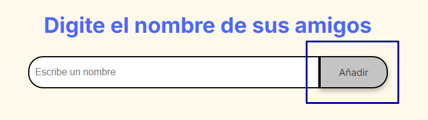
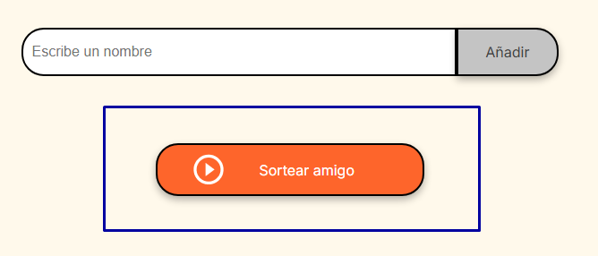

# 🎁 Challenge Amigo Secreto

¡Bienvenido a **Amigo Secreto**!  
Una aplicación creada para elegir a tu amigo secreto de forma rápida y aleatoria.

---

## 🛠️ Instalación

1. Cloná el repositorio:

```bash
`[https://github.com/agusbernabei/challenge-amigoSecreto.git] `
```
Abrí index.html en tu navegador.

¡Listo! Ya podés empezar a agregar nombres y hacer sorteos.

💻 Cómo usar:

Escribí el nombre de cada participante en el campo de texto.

Presioná Añadir    para agregarlos a la lista.

Cuando todos estén agregados, presioná Sortear amigo 🎲  .

Mirá tu amigo secreto en pantalla!


🔹Añade múltiples participantes fácilmente.

🔹Interfaz sencilla y amigable.

🔹Funciona offline.

🔹Compatible con todos los navegadores.


👤 Autor

  


Agustín Bernabei

[GitHub](https://github.com/agusbernabei)  | [LinkedIn](linkedin.com/in/agustin-bernabei-762b55230/) 


